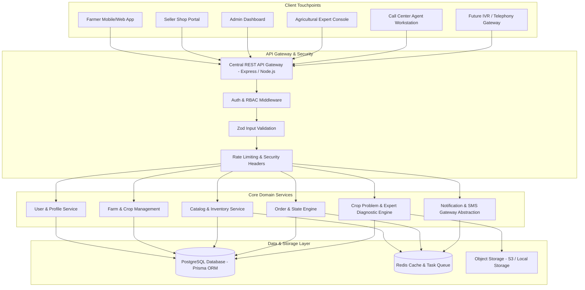

# FARM SEVA - Comprehensive Technical Architecture & Blueprint

## 1. System Overview Architecture

Farm Seva follows a **Clean Monolith / Decoupled Modular Architecture** where a central Node.js REST API service acts as the single source of truth for all client touchpoints (Farmer App, Seller Portal, Admin Dashboard, Expert Workstation, and Call Center Suite).



---

## 2. User Roles & Permissions Matrix (RBAC)

| Permission / Resource | FARMER | SELLER | AGRICULTURAL EXPERT | DELIVERY PARTNER | CALL CENTER AGENT | ADMIN |
| :--- | :---: | :---: | :---: | :---: | :---: | :---: |
| **Manage Own Profile / Farm / Crops** | ✅ | ❌ | ❌ | ❌ | ✅ (Assisted) | ✅ |
| **Shop & Inventory Management** | ❌ | ✅ (Own Shop) | ❌ | ❌ | ❌ | ✅ |
| **Browse / Search Catalog** | ✅ | ✅ | ✅ | ❌ | ✅ | ✅ |
| **Create Product Listings** | ❌ | ✅ (Draft/Pending) | ❌ | ❌ | ❌ | ✅ |
| **Approve Seller & Product Listing** | ❌ | ❌ | ❌ | ❌ | ❌ | ✅ |
| **Cart & Order Placement** | ✅ | ❌ | ❌ | ❌ | ✅ (Assisted) | ✅ |
| **Order Acceptance & Packing** | ❌ | ✅ (Assigned Shop) | ❌ | ❌ | ❌ | ✅ |
| **Order Pick & Delivery Status** | ❌ | ❌ | ❌ | ✅ (Assigned) | ❌ | ✅ |
| **Review Crop Problems & Submit Diagnosis** | ❌ | ❌ | ✅ (Assigned Queue) | ❌ | ❌ | ✅ |
| **Log Call Notes & Assisted Support** | ❌ | ❌ | ❌ | ❌ | ✅ | ✅ |
| **View System Analytics & Audit Logs** | ❌ | ❌ | ❌ | ❌ | ❌ | ✅ |

---

## 3. Database ERD & Data Schema Principles

### Core Entities & Relationships:
1. **User (1) <---> (0..1) FarmerProfile / Seller / Expert / DeliveryPartner / CallCenterAgent**
2. **FarmerProfile (1) <---> (N) Farm <---> (N) FarmField <---> (N) Crop**
3. **Seller (1) <---> (N) Shop <---> (N) Inventory <---> (1) Product**
4. **Category (1) <---> (N) Product <---> (1) ProductCompliance & (N) ProductImage**
5. **FarmerProfile (1) <---> (1) Cart <---> (N) CartItem <---> (1) Product**
6. **FarmerProfile (1) <---> (N) Order <---> (N) OrderItem <---> (1) Product**
7. **Order (1) <---> (1) Shop, (1) ShippingAddress, (0..1) Delivery, (0..1) Invoice, (N) Payment**
8. **CropProblem (1) <---> (N) CropProblemImage & (0..1) Consultation <---> (1) Expert**
9. **User (1) <---> (N) AuditLog, Notification, SupportTicket**

---

## 4. API Architecture & Standard Endpoints

All REST API endpoints follow a standardized JSON envelope format:

```json
{
  "success": true,
  "data": { ... },
  "error": null,
  "meta": {
    "page": 1,
    "limit": 20,
    "total": 150
  }
}
```

### Key Endpoint Groups:
- **Auth:** `POST /api/v1/auth/register`, `POST /api/v1/auth/login`, `POST /api/v1/auth/otp/send`, `POST /api/v1/auth/otp/verify`
- **Farmer Services:** `GET/POST /api/v1/farmer/farms`, `GET/POST /api/v1/farmer/crops`, `POST /api/v1/farmer/crop-problems`
- **Catalog & Shop:** `GET /api/v1/products`, `GET /api/v1/products/:id`, `GET /api/v1/categories`
- **Seller Workspace:** `POST /api/v1/seller/products`, `PATCH /api/v1/seller/orders/:id/status`, `GET /api/v1/seller/inventory`
- **Expert Workspace:** `GET /api/v1/expert/queue`, `POST /api/v1/expert/consultations`
- **Call Center:** `GET /api/v1/call-center/search-farmer`, `POST /api/v1/call-center/assisted-order`
- **Admin Governance:** `GET/PATCH /api/v1/admin/sellers/verification`, `GET/PATCH /api/v1/admin/products/approval`, `GET /api/v1/admin/audit-logs`

---

## 5. Key Workflows & State Machines

### 5.1 Strict Order State Machine
```
[DRAFT] -> [PENDING_ACCEPTANCE] -> [ACCEPTED] -> [PACKING] -> [DISPATCHED] -> [OUT_FOR_DELIVERY] -> [DELIVERED]
                  |                     |           |
                  v                     v           v
             [REJECTED]            [CANCELLED]  [CANCELLED]
```

### 5.2 Crop Problem Diagnostic & Compliance Workflow
1. **Submission:** Farmer uploads photo + describes crop symptoms via Web App or Call Center Agent.
2. **System Queue:** Ticket classified as `SUBMITTED` and assigned to specialized Expert (Pathology / Entomology).
3. **Safety Check:** System enforces **No Auto-Prescription**. AI pre-tags visual symptoms only for the expert's review.
4. **Expert Action:** Expert views crop history, land acreage, and images -> drafts diagnosis + approved safety precautions.
5. **Closure & Guidance:** Consultation completed -> SMS alert sent to farmer in preferred language (Telugu, Kannada, Hindi, etc.).

---

## 6. Security, Compliance & Regulatory Plan

1. **Authentication:** Password hashing via `bcrypt` (12 rounds), stateless JWT access tokens (15m expiry) + HTTP-only refresh tokens.
2. **Regulatory Safety Enforcement:**
   - Products with Red/Yellow hazard classifications flag compliance alerts.
   - Dosage instructions must display standard manufacturer label references.
   - All seller pesticide licenses (`pesticideLicenseNo`) verified by Admin before catalog activation.
3. **Data Protection:** OWASP Top 10 mitigation via `helmet`, `cors`, Zod strict payload validation, SQL injection prevention via Prisma parameterization.
4. **Audit Logging:** Every administrative override, seller verification, and call-center assisted order produces an immutable `AuditLog` entry.

---

## 7. Deployment & DevOps Plan

- **Containerization:** Docker container for API and Web apps with multi-stage builds.
- **Orchestration:** `docker-compose.yml` for local development & staging. Production deployment via Kubernetes or AWS ECS.
- **Database Migrations:** Prisma automated migration scripts (`npx prisma migrate deploy`) executed during deployment pipeline.
